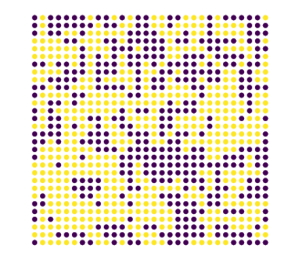
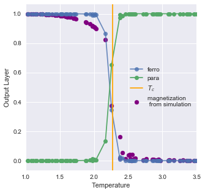

# Machine Learning phase transitions of the 2D Ising model
This whole notebook is an attempt to explore an reproduce the results of the paper by Carasquilla and Melko  https://www.nature.com/articles/nphys4035

I simulate the Ising model using the Metropolis algorithm and feed the configurations through an ANN, each configuration is labeled by whether or not it was sampled above or below the critical temperature. 

* Example 30 by 30 lattice configuration

* Output of network and true magnetization vs temperature 

## Future work
* Tune hyperparameters for better performance on triangle data
* Generate Ising model configurations using a different Monte Carlo Method
* Generalize to q-state pots model
* add CNN to learn Ising guage model

